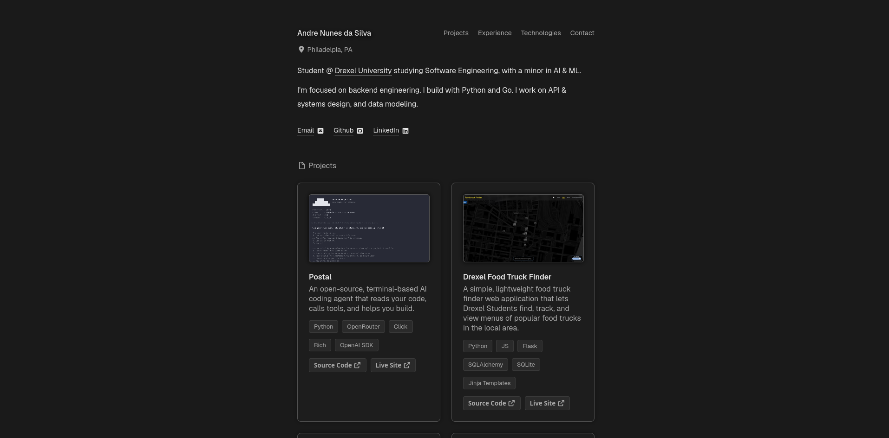

# Portfolio - andresilva.tech

A sleek, modern, minimalist portfolio that gets straight to the point, a one pager that includes an about section, projects, experience, tech stack, and how to contact. 

**Live Site:** [andresilva.tech](https://andresilva.tech)

  

## Why vanilla HTML/CSS
Not a heavy component-based project, so I skipped the framework overhead and built it in vanilla HTML5 and CSS3.

## Sections
- **About:** dark-theme, tab-switcher layout
- **Projects:** featured work with links
- **Experience:** background/timeline
- **Tech Stack:** tools and languages I work with
- **Contact:** how to reach me

## Deployment
Hosted on GitHub Pages with a custom domain ([andresilva.tech](https://andresilva.tech)) and HTTPS.

## Roadmap
- [x] Deploy Live
- [ ] Mobile/Different Screen Ratio Responsivness
- [ ] More Projects Btn -> redirects to my GitHub
- [ ] Src Code Button -> redirects here

## License
MIT
